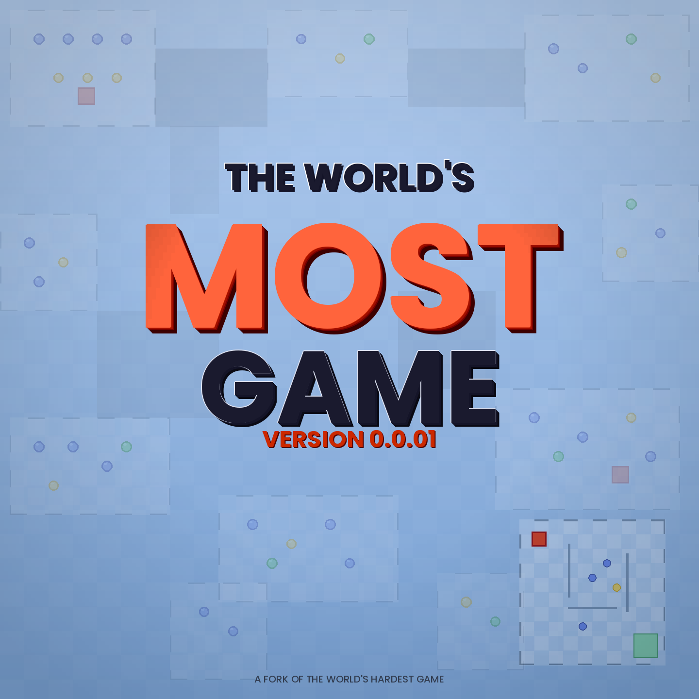

# The World's Most Game

A fork (and love letter) to *The World's Hardest Game* — rebuilt from scratch in Python with Pygame.



## What is this?

It's a rage game. You're a little red square. You dodge things. You collect coins. You die. A lot.

But here's the twist — every single level in this game is generated from a tiny pixel art image. Draw a 32x32 PNG, assign colors to walls, safe zones, and transitions, and the engine turns it into a fully playable level. No tile editor, no level designer tool — just pixel art and code.

## How we built it

This started at a hackathon with a simple question: *can we rebuild The World's Hardest Game from nothing?*

No game engine. No framework beyond Pygame for rendering. We wrote our own collision system, our own level parser, our own enemy movement patterns (sinusoidal, linear, square patrol paths), and our own map-to-screen pipeline. The entire game loop, menu system, and level transitions were built by hand.

The pixel-art-to-level pipeline is the core of the project. A small PNG image gets read pixel by pixel — each color maps to a game element:
- Black pixels become walls
- Green pixels become safe zones / spawn areas
- A specific green becomes the "next level" transition zone
- Everything else becomes the playable checkerboard floor

Wall borders are drawn automatically by checking neighbors, so levels look clean without any manual border placement.

## What makes it different

- **Levels from pixel art** — Anyone can create a level. Open MS Paint, draw a 32x32 image with the right colors, drop it in `/assets`, and wire it up. That's it.
- **Built from scratch** — There's no engine doing the heavy lifting here. Every system was written by us, for better or worse.
- **Enemy variety** — Sinusoidal enemies, linear bouncers, and square-patrolling enemies with configurable speed, amplitude, delay, and direction. Mixing these creates surprisingly complex patterns.

## Our shortcomings (we're being honest)

- The code could be cleaner. There's duplicate logic we haven't fully consolidated yet, and some globals that should probably be refactored.
- Level design is still manual wiring in a match statement — we'd love a proper level loader that reads from a config file.
- No sound. At all. The game is silent and it definitely suffers for it.
- The UI is bare minimum — functional but not pretty.
- We only have 4 real levels right now.

We know there's rough edges. But it works, it's fun (and infuriating), and we built the whole thing ourselves.

## What's next

We want to keep going with this:
- A proper level loader so anyone can drop in levels without touching code
- Sound effects and music
- More enemy types (circular paths, chasers, etc.)
- A level editor UI
- Online level sharing — that's the dream

## How to run it

**Requirements:**
- Python 3.10+ (we use match/case syntax)
- Pygame
- Pillow (PIL)

**Install dependencies:**
```bash
pip install pygame pillow
```

**Run the game:**
```bash
python main.py
```

**Controls:**
- **WASD** — Move
- **M** — Return to menu / quit
- **Mouse click** — Menu navigation

## Project structure

```
main.py            — Game loop, sprites, menus, everything
LevelFunctions.py  — Pixel art parser, wall renderer, level utilities
assets/            — Sprite images and level PNGs
```

---

*A fork of The World's Hardest Game. Built at a hackathon. Still going.*
